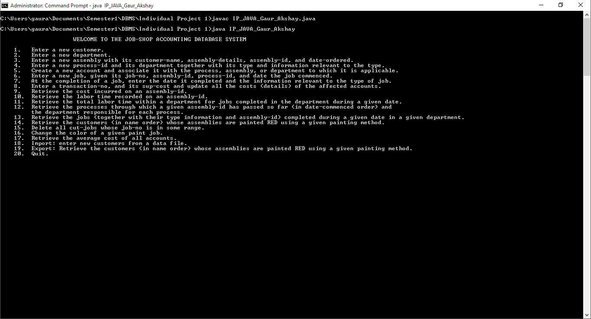
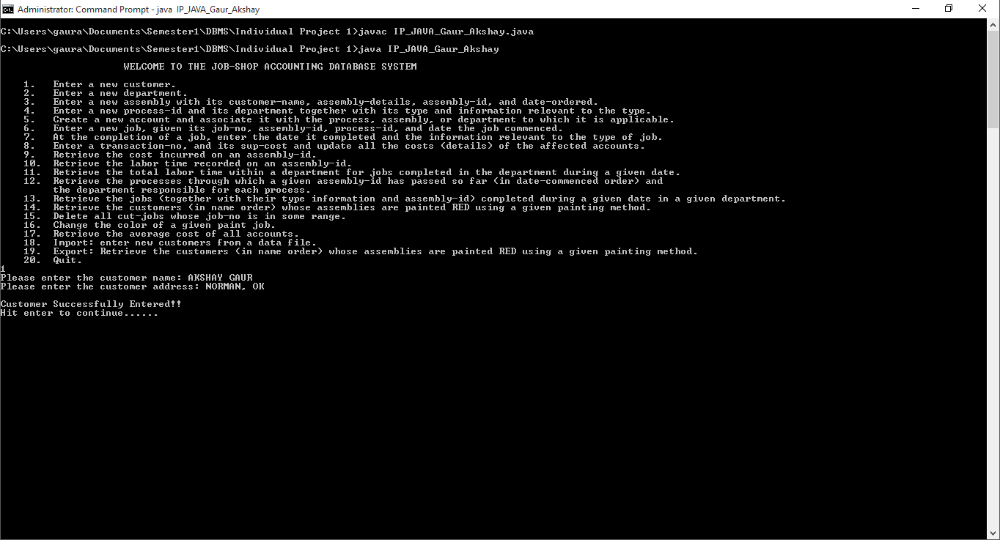
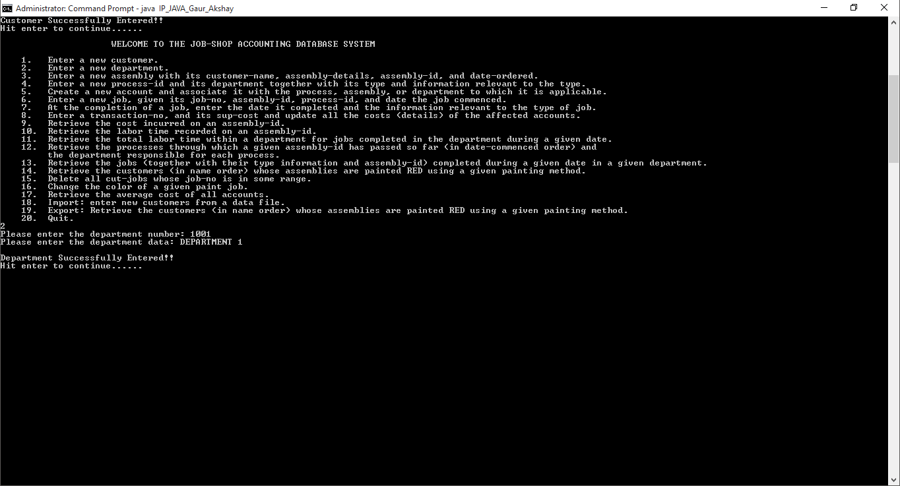
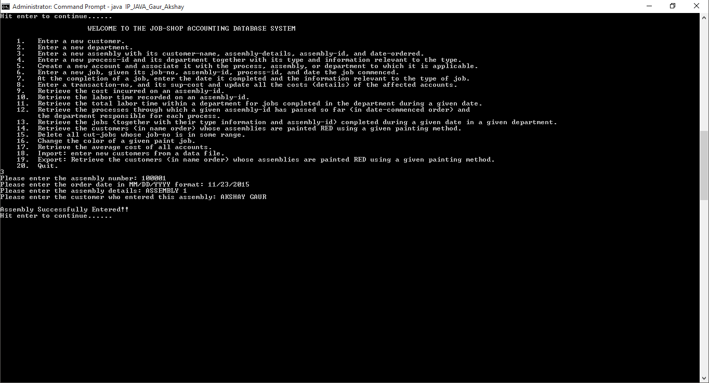

# CS-4513-JobShopAccounting
Command line Java program that runs queries in an Oracle DB.

## DESCRIPTION

A job-shop accounting system is part of an organization that manufactures special-purpose assemblies for customers.   
 
A customer has a unique name and an address.  A customer can order several assemblies.  Each assembly is identified by a unique assembly-id, and has a date-ordered, and assemblydetails.   To manufacture assemblies, the organization contains a number of processes, each of which is identified by a unique process-id and is supervised by one department.  Each department has its own department number and department-data.  Each process also has process-data.  Processes are classified into three types: paint, fit, and cut.  The following information is kept about each type of process:

*Fit: fit-type

*Paint: paint-type, painting-method

*Cut: cutting-type, machine-type

During manufacture an assembly can pass through any sequence of processes in any order; it may pass through the same process more than once. 
 
A job is assigned every time a process begins on an assembly.  Information recorded about a job includes a unique job-no, a date the job commenced, and a date the job completed as well as additional information that depends on the type of job.   Jobs are classified into three job types: cut-job, paint-job, and fit-job.  Information stored about particular job types is:

* Cut-job: type of machine used, amount of time the machine used, material used, and labor time

* Paint-job: color, volume, and labor time

* Fit-job: labor time. 
 
An account is maintained by the organization to keep track of expenditure for each process, each assembly, and each department.  For each account, the database stores its unique account number and the date the account established. Three types of accounts are maintained:

* Assembly-account to record costs (details-1) for assemblies.

* Department-account to record costs (details-2) for departments.

* Process-account to record costs (details-3) for processes. 
 
As a job proceeds, cost transactions can be recorded against it.  Each such transaction is identified by a unique transaction number, and is for a given cost (sup-cost).  Each transaction of necessity updates three accounts:

* A process account

* An assembly account

* A department account

The updated process account is for the process used by a job.  The updated department account is for the department that manages that process.  The updated assembly account is for the assembly that requires the job.
 
On-line queries and their frequencies for the job-shop accounting system: 
 
1. Enter a new customer (30/day).

2. Enter a new department (infrequent).

3. Enter a new assembly with its customer-name, assembly-details, assembly-id, and dateordered (40/day).

4. Enter a new process-id and its department together with its type and information relevant to the type (infrequent).

5. Create a new account and associate it with the process, assembly, or department to which it is applicable (10/day).

6. Enter a new job, given its job-no, assembly-id, process-id, and date the job commenced (50/day).

7. At the completion of a job, enter the date it completed and the information relevant to the type of job (50/day).

8. Enter a transaction-no, and its sup-cost and update all the costs (details) of the affected accounts by adding sup-cost to their current values of details (50/day).

9. Retrieve the cost incurred on an assembly-id (200/day).

10. Retrieve the labor time recorded on an assembly-id (100/day).

11. Retrieve the total labor time within a department for jobs completed in the department during a given date (20/day).

12. Retrieve the processes through which a given assembly-id has passed so far (in datecommenced order) and the department responsible for each process (100/day).

13. Retrieve the jobs (together with their type information and assembly-id) completed during a given date in a given department (20/day).

14. Retrieve the customers (in name order) whose assemblies are painted RED using a given painting method (50/day).

15. Delete all cut-jobs whose job-no is in some range (1/month).

16. Change the color of a given paint job (1/week). 

17. Retrieve the average cost of all accounts (5/day)

## Screenshots

#### Welcome

#### Query 1

#### Query 2

#### Query 3

